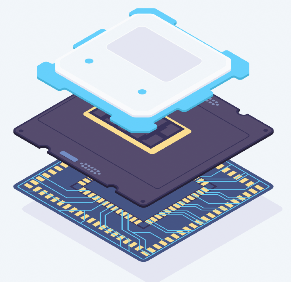
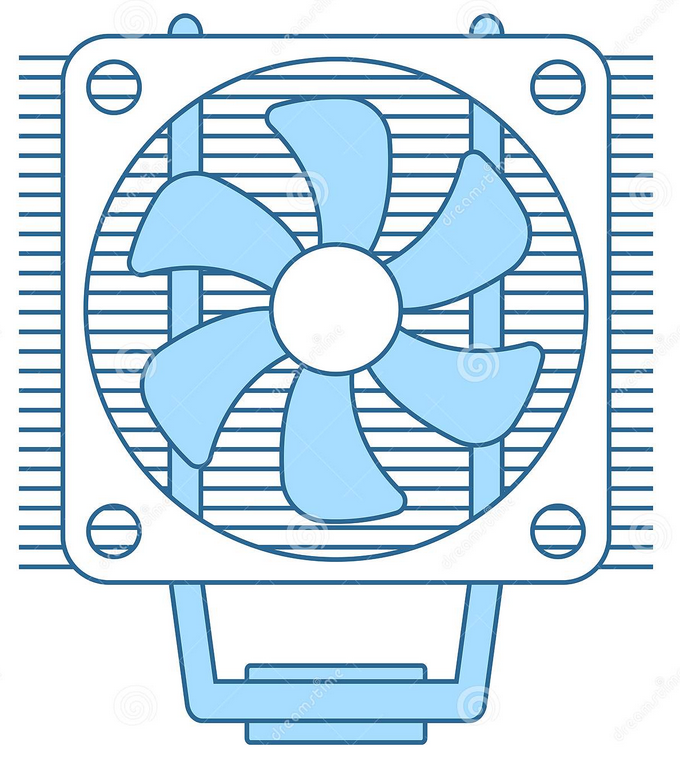
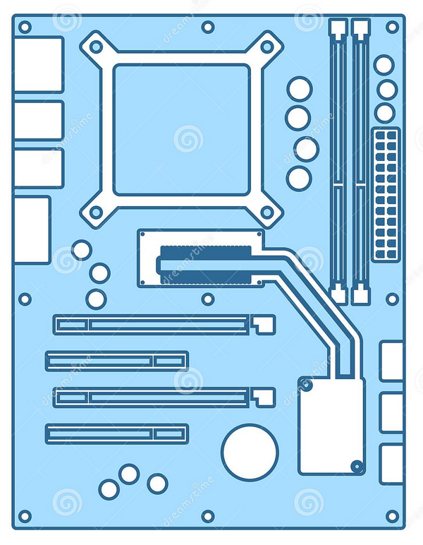
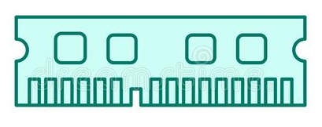
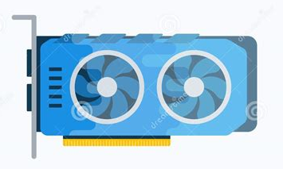
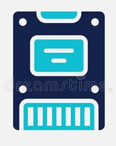
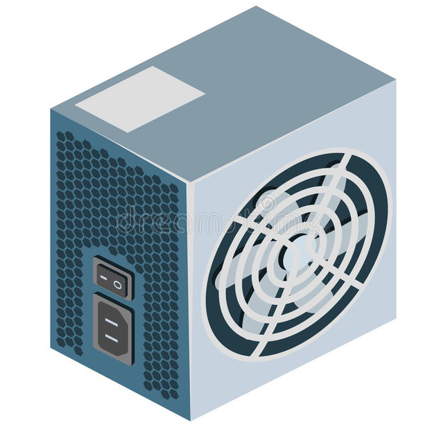
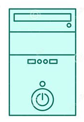

# Beginner's Introduction Guide to PC Building

## Components
Inside the case of every computer is the following:

* CPU
* CPU Cooler
* Motherboard
* Memory
* Graphics Card
* Storage
* PSU

### CPU - Central Processing Unit

{: style="width:15em"}

The CPU, or Central Processing Unit, is one of the most important parts of any PC. As the primary hub, it processes instructions that come from programs, the operating system, or other components in the computer. Not too long ago, these functions had to be split across multiple processors to be completed, but manufacturing and design improvements have made it so that the entire CPU can fit onto a single chip.

CPUs work in sequence, which means that every instruction set processed can only be executed in order, one after another. This process happens in three stages: fetch, decode, execute. The CPU takes (fetches) the instruction, processes (decodes) it to be able to read it properly, and then executes it.

!!! tip "Fun Fact"
    The 4-bit Intel 4004 was the world's first commercial CPU introduced in 1971. It clocked at 740 KHz and could execute up to 92,600 instructions per second. For perspective, the new 12th Gen Intel Core i9 clocks up to 5.2 GHz and can execute over a million instructions per second!

Originally, CPUs had a single core. Meaning that the physical CPU had just a single central processing unit on it. To increase performance, manufacturers add additional cores. Multicore processors are made up of two or more CPUs on a single chip. The individual cores can execute multiple instructions in parallel, which greatly increases software performance while multi-tasking.

!!! info
    There are two major CPU manufacturers: **Intel** and **AMD**. Both companies frequently trade places for offering better value in terms of cores and threads, without sacrificing too much in the performance department.

For even greater performance enhancement, manufacturers Intel and AMD began using "hyper-threading" and "simultaneous multithreading (SMT)", respectively. A thread is a virtual version of a CPU core. A single CPU core can have up to two threads per core (e.g. A dual core CPU will have four threads). While cores increase the number of tasks available to execute at one time, threads improve overall performance by being able to manage the task processes.

!!! example
    Opening an application on a computer creates a **thread** to handle tasks associated with that particular application. Opening and running more applications creates more threads.

#### Sockets
The CPU Socket is where the CPU is housed when installed onto the motherboard. Socket types are built into the motherboard and cannot be changed. Each pin is wired to communicate with a specific part of the system.

#### Chipsets
For a given CPU, there's often a choice of chipsets that support it. A chipset acts as the motherboard's communications center and traffic controller. It determines component compatibility, expansion options, and overclockability.

Below is a table showing common CPUs, their socket type, and corresponding available chipsets.

|Processor | Socket | Chipsets |
|:-------:|:-------:|:-------:|
|Core i9/i7/i5/i3-12XXX | LGA1700 | Z690 Platform |
|Core i9/i7/i5/i3-10XXX | LGA1200 | Z490/Z590 Platform |
|Core i7/i5/i3/Pentium/Celeron | LGA 1151 | Z390 Platform |
|Core X-Series Processor | LGA 2066 | X299 Platform |
|AMD Ryzen | AM4 | B450/A320/X470/B550/X570 Platform |
|AMD Ryzen Threadripper | sTRX4 | TRX 40 Platform |

!!! tip "Simply Put"
    A **socket** determines if a CPU will physically fit and work on that motherboard while the **chipset** determines features and properties the board has. (e.g. A Z170 is the same socket type as H170, but only the Z board can overclock.)

#### Overclocking
In order to overclock a processor, the user intentionally increases the CPU operation frequency above the original stock specifications. Because the processor's frequency heavily impacts the effective computational speed of the CPU, the ultimate goal is to increase the frequency of the CPU in order to achieve faster performance.

### CPU Cooler
{: style="width:15em"}

CPUs produce a lot of heat. High temperatures can cause the system to shut down in order to protect important components, and may even cause permanent damage. Fans and heatsinks are therefore necessary in order to keep the CPU running cool.

!!! info
    With the exception of some high-end CPUs, most boxed CPUs are bundled with a corresponding CPU cooler which can meet basic demands for heat dissipation. For better system performance, it is suggested to purchase a separate CPU cooler.

Coolers can be classified in terms of heat dissipation medium into two types: liquid cooling and air cooling. Air coolers can be further classified into tower-style, downdraft, and updraft coolers, depending on their appearance and airflow direction.

#### Consider the Following
* Coolers need to provide corresponding brackets, as bracket positioning may vary slightly depending on the socket on the motherboard.

* Each CPU cooler supports a different thermal design power (TDP), indicating the upper range of heat output that it can handle. More powerful CPUs need better coolers to ensure stable operation.

* Choose a cooler that fits the PC Case. Powerful coolers often have large heat sinks, so it is important to choose a cooler that can fit into the case without obstructing other components.

### Motherboard
{: style="width:15em"}

The motherboard, also called the mainboard, links all the components of the computer, connecting the processor, memory modules, graphics and expansion cards, hard drives, and connections to the network, keyboard, mouse, and more.

#### Dimensions
Common motherboard sizes include:

* ATX (30.5cm x 24.4cm)
* Micro-ATX (24.4cm x 24.4cm)
* Mini-ATX (17cm x 17cm)

### Memory - RAM
{: style="width:15em"}

Random Access Memory (RAM) is used to load and run applications, respond to commands, or toggle between multiple programs. Memory is almost always being actively used by the PC operating system. Different programs require different amounts of RAM, but regardless of the application, it's likely to use a small amount. Adding up over time, if too much RAM is being used at one time, the applications currently being used will slow down severely.

#### Capacity Comparison

| 4GB | 8GB | 16GB | 32GB+ |
|-----|-----|------|------|
|Bare Minimum. Adequate only for word processing, e-mail, and web browsing | Standard. Minimum required for gaming.| Ideal for gaming and most systems and tasks | Any kind of system intensive, workstation-grade tasks; programming, virtual machines, photo and video editing. |

### GPU - Graphical Processing Unit
{: style="width:20em"}

A GPU, or graphics card, is an expansion card that fits into the PCIe slot on the motherboard. It handles complex graphical instructions, computing images, textures and objects, and sends the result to one or more monitors. The motherboard may have HDMI, DisplayPort, or older DVI or VGA ports, driven by the integrated graphics GPU inside some processors.

### Storage
{: style="width:10em"}

Storage has evolved from hard drives that use magnetic technology to store data on spinning disks. Reaching 20 terabytes (TB) or more, 4 to 8 TB drives are a cost-effective option for mass storage. But, with data transfer around 140 or 180 megabytes (MB) per second, speed is far surpassed by Solid State Drives (SSDs) and SATA m.2 drives.

### PSU - Power Supply
{: style="width:15em"}

Power supply is important when building a PC, as it converts AC power into DC power for the CPU, motherboard, graphics card, and all peripherals. General guidelines are as follows:

- 500-600 Watts for a PC using the web and office apps.
- 650-850 Watts for a PC using any external GPU.

    !!! help "Unsure?"
        Check the GPU's power requirements for exact measurements.

#### Energy Efficiency
The 80 Plus certification program for power supply units offers 80 Plus, 80 Plus Bronze, 80 Plus Silver, 80 Plus Gold, 80 Plus Platinum and 80 Plus Titanium certification levels. The most efficient (and most expensive) Titanium tier offers more than 90% energy efficiency.

The 80 plus bronze, silver, gold, platinum and titanium ratings have 2 to 3 percent efficiency gains between tiers, starting with bronze at 82 percent, and titanium having 92% efficiency, though that comes with a price. Modular power supplies can reduce cable clutter in the PC case, and can make wiring components and cable management easier. And note that CPU and PCI 6+2 connectors may look the same, but they won't fit each other's sockets.

#### Power Supply Design
Below is a table covering the different pros and cons between the three PSU design types on the market.

| | Full Modular| Semi Modular | Non Modular|
|----|----|----|----|
|Air Flow | Excellent air flow due to less cable clutter | Good air flow with good cable management | Bad air flow due to cable clutter |
| Temperature | Low temperature reading due to less cable clutter | Fine temperature reading due to good air flow and cable management | Poor cable management will result in high temperature |
|Aesthetics | Easy to organize and manage for good looks | Good looks with decent cable management | Messy looks due to too many cables|
|Convenience | Convenient PSU replacement | Easier PSU replacement with less cables to unplug | Need to remove all cables when switching PSU |
|Customization | Can be fully customized | Limited customization options | No customization options |

!!! warning
    If a motherboard that supports overclocking is purchased, it may require dual ATX 8 pin or 8+4 pin for the CPU. Check to make sure the selected power supply has them.

### Case
{: style="width:10em"}

Selecting a case can be done mostly to personal taste, but there are a few factors to keep in mind.

- The case needs to have good air flow, so there should be lots of fan mounting spots. Also look for wide openings at the front for air to enter, and having them filtered will help keep dust out of the case.
- Check what size motherboard the case will accept, most motherboards are ATX sized and won't fit in smaller cases.
- Check the length of GPU the case accepts, as newer graphics cards can reach 27-33cm in length. Fourth, check the case for mounting spots for all storage devices.
- For air cooling, check the case's maximum CPU cooling height in millimeters, having at least a few mm more than the height of the actual cooler.
- For liquid cooling, the radiator needs a spot to mount to the case, so check for 240 or 360mm rad mounting locations at the front or the top. The top is the recommended location for keeping the inside of the case cool as the rad will exhaust directly outside the case.

    !!! danger
        **Never** mount the rad at the bottom of the case. The pump should never be at the very top of a liquid loop as the small amount of air in the loop will want to pool there, reducing the efficiency of the CPU cold-plate and pump.

- Tempered glass panels show off the internals but add considerable weight, and care must be taken when transporting and after installation, being careful not to torque fasteners too tightly on the glass as over time this can cause it to shatter.

## Operating Systems
An operating system is considered to be the backbone of any system. Without an operating system, the user and system cannot interact. The three most universally used operating systems are: Windows, MacOS, and Linux.

- **Windows** is developed by Microsoft and is comparatively the most accessible operating system on the market.
- **MacOS** is developed by Apple for their Macintosh systems and is geared towards users that want performance fused with simplicity.
- **Linux** is a free, open-source family of operating systems initially developed by Linus Torvalds and later added onto by the GNU Project and the Linux community. It is mainly used by enthusiasts and companies that run servers and applications with the need of high security and no downtime.
