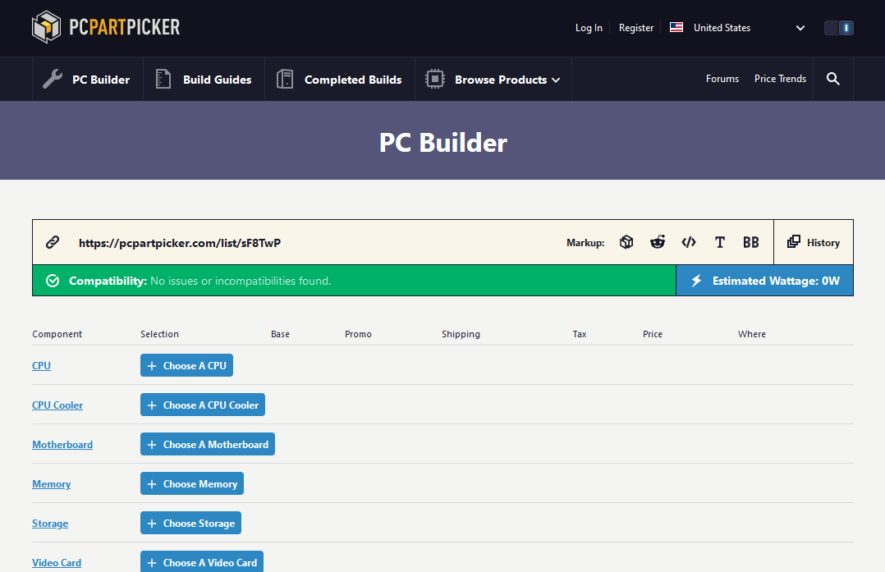
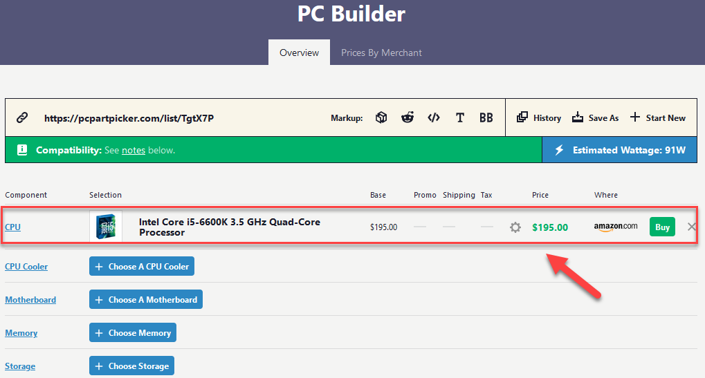
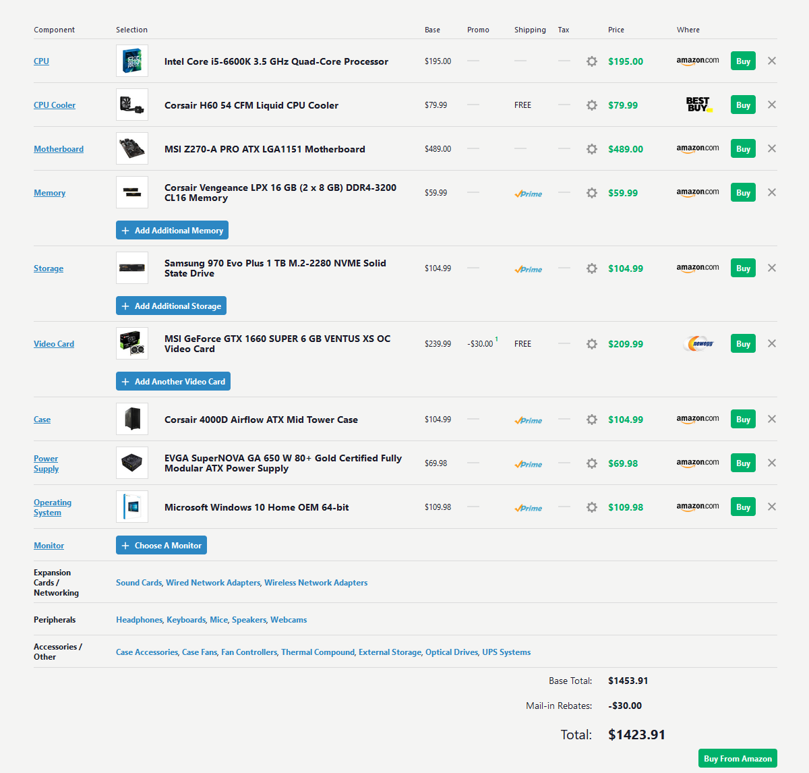
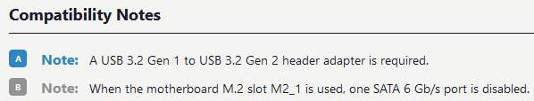

# Beginner's Hardware Purchase Guide for PC Building

## Build Planning

### Purpose

When planning to build a personal computer, having a clear idea of the type of tasks it will be performing on a daily basis is paramount. A PC being used for gaming or video editing will have very different hardware requirements than a PC being used for occasional word processing and internet browsing.

### Budget
Having a budget in mind is of upmost importance when planning a PC build. Having to decide between performance and affordability is quite common for the average PC builder, so knowing limits before drafting a part list is always recommended.

Below is a table of cost ranges, the type of tasks computers built with that cost range can execute, and the primary component that influences performance on those tasks.

| Desktop      | Gaming    | Workstation|
|:--------------:|:-----------:|:------------:|
| $300-$800    |$900-$1,500| $1,600+   |
|   Web Browsing, Office Apps, Audio/Video Playback    | Gaming, Audio/Video Editing, Crypto Mining  | Audio/Video Encoding, Number Crunching, Virtual Machines, Databases|
| Single Core CPU Performance |  GPU Performance | Multi Core CPU and GPU Performance |

Once the budget and desired performance level has been decided, the part list can be created. To make this task less daunting, PC Part Picker will be used to assemble the part list. This site provides computer part selection, compatibility, and pricing guidance on all PC hardware that is available to order online right now.

## Creating the Part List

### PC Part Picker
Go to [pcparkpicker.com](https://pcpartpicker.com) on your web browser and select **PC Builder** on the navigation bar.

{: style="width:40em"}

The following page should load:

{: style="width:40em"}

!!! tip
    PC Part Picker generates a hyperlink of the part list for easy sharing and storage.

    {: style="width:25em"}

The part list is now ready to be created.

#### Component Selection
To begin, select **Choose a CPU.**

{: style="width:20em"}

Since this is the first component, PC Part Picker will return every CPU on the online market right now. Once more components are added to the part list, the compatibility filter will alter the results to show only products compatible with the items on the list.

{: style="width:25em"}

#### Narrowing Product Options  
The following are three tools PC Part Picker provides that help manage which results are displayed.  

_____________________________________________________________

##### Sort Tool

The **sort tool**, to the right of the Compatible Products text, arranges the results based on what sort method is selected.

{: style="width:30em"}

##### Filter Tab

The **filters tab**, to the far left of the screen under the Merchants/Pricing tab, removes certain products from the results based on the selected specifications.

{: style="width:10em"}

!!! help
    If a combination of specifications are selected that are not compatible, no results will return. Be sure to check the filter selection when getting undesired results.  

    {: style="width:50em"}

##### Search Bar

The **search bar**, to the right of the sort tool, can be utilized to find the desired product swiftly.

{: style="width:30em"}

#### Add to List

Once the desired product is listed, click **Add** to add that component to the PC Part List.

{: style="width:30em"}

 The page will redirect back to the original list with the selected product now present.

{: style="width:30em"}

Repeat these steps for adding the rest of the components to the part list as seen below:

{: style="width:40em"}

### Compatibility Notes

Underneath the Part List, there is a **Compatibility Notes** section that discloses select information of each component that requires attention from the PC builder during construction.

{: style="width:30em"}

Each letter in the Compatibility Note section corresponds to the same letter in the Motherboard Usage diagram (see section below), highlighting that specific component and giving visual context to the note.

{: style="width:30em"}

#### Usage Diagram

Underneath the Compatibility Notes, a **Motherboard Usage** diagram is displayed to help identify which components from the list are filling what section of the motherboard. This can be useful for having a basic visualization of the interaction between the components and motherboard.

{: style="width:30em"}

## Check Out

### Merchants

By default, PC Part Picker selects the merchant with the product's current lowest price. Looking at the final list, all but two of the items can be purchased on Amazon for the lowest price.

{: style="width:10em"}

To simplify the buying process further, the merchants can be edited to reflect the user's preference.

#### Changing Merchants

Click the **small gear** to the left to the part price.

{: style="width:20em"}

A popup will appear to give the option to change merchants regardless of price.
Select **Amazon** from the **Use Current Price From Specific Merchant** option.

{: style="width:25em"}

Click **Save Part Price Setting** to save the changes made.

{: style="width:25em"}

Checking the list, Best Buy has been overridden by Amazon as the primary merchant.

{: style="width:40em"}

Repeating this step for the GPU, all parts are now selected to be purchased using Amazon.

{: style="width:40em"}

### Final Purchase
Click **Buy From Amazon** to order all parts on the list at once.

{: style="width:20em"}

The page will open a New Tab and redirect to **Amazon.com** with all parts ready to be added to cart.

{: style="width:30em"}

Select **Add to Cart** and complete the purchase through Amazon.

{: style="width:10em"}
