# Beginner's Hardware Installation Guide for PC Building

## Preparation

### Required Tools

- Screwdriver (magnetic preferred, but not required)
- Zip Ties or Velcro Straps (some parts come with these, check the box beforehand)
- Non Conductive Surface for Assembly

### Part Check
If not done already, unbox all components and insure that all hardware, brackets, screws, and other accessories are present.

_______________________________________________

The order presented is recommended based on past experience. Technically, components can be installed in any order (besides the CPU cooler before the CPU), but this order has proven to have the least issues and smoothest construction.

## Step 1 - CPU Installation
Locate the CPU socket on the motherboard. Consult the manual for the exact location.

1. Unlatch lid of the CPU socket.
2. Line up the triangle notch printed on CPU with guiding triangle notch printed on the socket. (usually in the bottom left corner)
3. Carefully insert CPU inside socket.

    !!! caution
        Be careful with CPU socket pins, they are quite fragile and any slight collision can bend them, causing functionality errors later on.

4. Ensure CPU proper placement and close lid of socket to lock it onto the processor.

    !!! help "Strange Noises?"
        **Intel:** There will be a few popping and cracking noises during this process, as the pins are being raised from the socket of the motherboard to make contact with the CPU. Be sure to check CPU orientation regardless.

        **AMD:** There should be **no** crunching noises during installation as the processor should effortlessly fall into the socket. Check the orientation of the CPU and consult the CPU manual for details.

5. If the processor protective plate does not disengage after step 4, gently remove it.

### Intel Illustrated Guide

| Step 1 | Step 2 | Step 3 | Step 4 |
|:-:|:-:|:-:|:-:|
|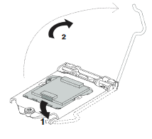 | 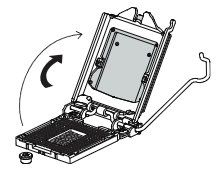 | 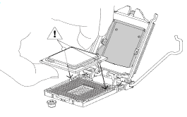  |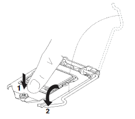 |

### AMD Photo Guide
| Step 1 | Step 2 | Step 3 | Step 4 |
|:-:|:-:|:-:|:-:|
|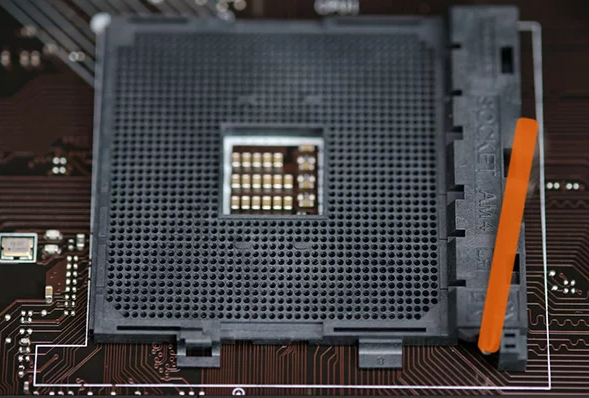 | 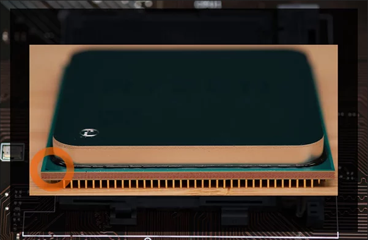 | 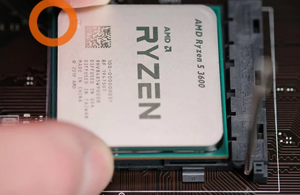  |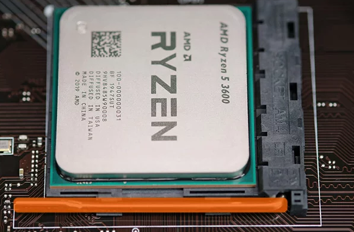 |

### Video Demonstration

#### Intel CPU Installation

#### AMD CPU Installation

!!! help "Still Unsure?"
    If ever unsure of installation method, review the motherboard manual for detailed instructions on CPU installation.

## Step 2 - Memory Installation
Locate the DIMM slots on the motherboard. Consult the manual for the exact location.

1. Press down on the lock/eject tabs on the ends of the memory socket.
2. Consult the memory module installation order outlined in the motherboard manual

    !!! caution
        **Do not skip this step!** The suggested sequence of which memory slots to be installed first differs greatly between motherboards and if done incorrectly can lead to issues during PC start up.

3. Push the modules down until an audible **click** is heard. The retention clips will be pushed upwards and lock the RAM into the module.

### Illustrated Guide

| Step 1 | Step 2 | Step 3 |
|:-:|:-:|:-:|
|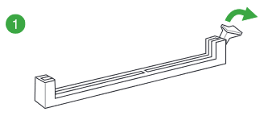 | 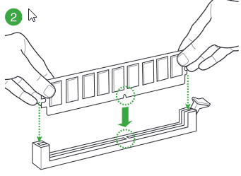 | 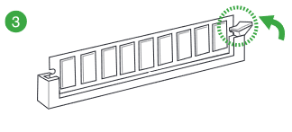  |

### Video Demonstration

!!! help "Still Unsure?"
    If ever unsure of installation method, review the motherboard manual for detailed instructions on RAM installation.

## Step 3 - M.2 Drive Installation
Locate the M.2 socket on the motherboard. Consult the motherboard manual for the exact location.

!!! question "If Heatsink is Pre-Installed"
    Some motherboards ship with a heatsink pre-installed in the M.2 socket. Be sure to remove it and place it to the side before proceeding.

1. Take the M.2 drive and gently insert it into the M.2 socket at a 30 degree angle.
2. Push the drive down towards the support assembly.

    !!! example "Heatsink Owners Only"
        Take heatsink, remove the plastic, insert the notch to the top of the M.2 socket, and lay the heatsink flush with the M.2 drive. Proceed with the next step.

3. Secure the drive with the corresponding screw.

### Illustrated Guide

| Step 1 | Step 2 | Step 3 |
|:-:|:-:|:-:|
|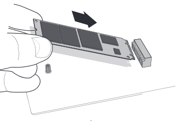 | 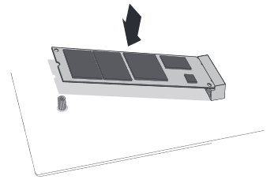 | 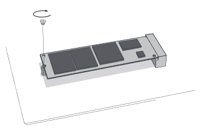  |

### Video Demonstration

!!! help "Still Unsure?"
    If ever unsure of installation method, review the M.2 manual for detailed instructions.

## Step 4 - CPU Cooler Installation
Locate the back of the motherboard.

1. Mount the back-plate onto the back of the motherboard.
2. Apply a pea-sized drop of thermal paste onto the surface of the processor.

    !!! warning
        **Be mindful while performing this step.** Too little paste can cause poor contact while too much can cause excess paste to bleed into the socket.  

3. Lower the cooler vertically and place it onto the CPU. Secure it by evenly tightening opposite screws progressively. Make sure the screws are tightened properly, and the pressure applied at the corners is even to avoid CPU damage and cooling performance degradation.

4. Connect CPU Fan Cable to the CPU Fan Header on the motherboard.

### Illustrated Guide
| Step 1 | Step 2 | Step 3 | Step 4 |
|:-:|:-:|:-:|:-:|
|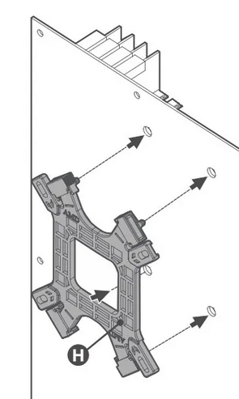 | 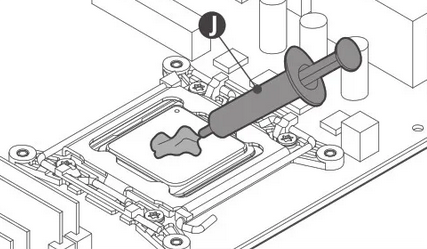 | 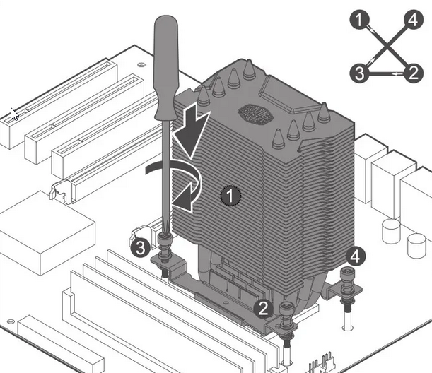  |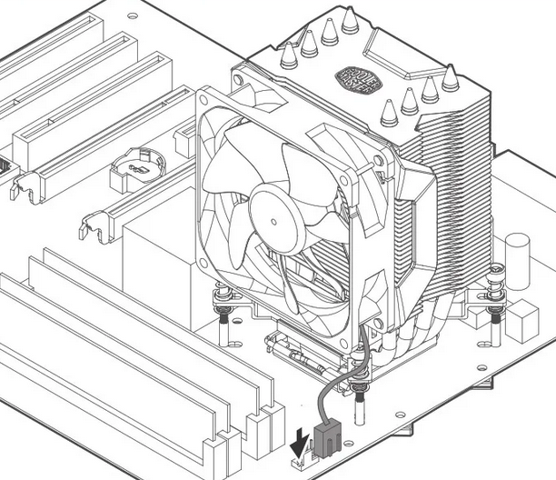  |

### Video Demonstration

!!! help "Still Unsure?"
    If ever unsure of installation method, review the motherboard manual for detailed instructions on CPU Cooler installation.

## Step 5 - Motherboard Installation
Locate PC Casing and remove side panel before proceeding.

1. Install I/O shield onto the back of the case.
2. Gently lower the motherboard at a 45 degree angle into the case.
3. Match the mounting holes on the motherboard with the stand-offs in the case.
4. Secure the board with each of the supplied screws.

### Illustrated Guide

### Video Demonstration

## Step 6 - Storage Installation
1. Connect one end of the SATA cable to the SATA ports on the motherboard, and the other end to the storage device itself

!!! Tip
    Make sure you mount the hard drive tight to avoid damage.

### Illustrated Guide
### Video Demonstration

## Step 7 - Graphics Card Installation
1. Remove rear PCI-e bracket from the case.
2. Unlock the PCI-e slot by pushing back the small plastic lock located at the rear of the slot.
3. While holding the card with two hands, lower it into the case and place it into the PCI-e slot of the motherboard.
4. Secure the graphics card with the required screws to the back of the chassis.

### Illustrated Guide
### Video Demonstration

## Step 8 - Power Supply Installation
1. Mount the Power Supply (PSU) into the chassis and secure it with all screws.
2. Connect 24-pin power connector into the socket on the motherboard.
3. Connect 8-pin CPU power connector to the motherboard.
4. Connect 6+2 pin PCI-e Cable to graphics card (check GPU manual for details).
5. Clip in SATA power connector to hard drive.
6. Connect other Molex connectors (4 horizontal pins) to any extra devices.

### Illustrated Guide
### Video Demonstration

## Step 9 - Front Panel Connectors and Cable Management
1. Connect Power Switch/Reset Switch/power LED/HDD LED Cable to motherboard JFP1 Pin header.
2. Connect front USB cables to USB pin headers on the motherboard.
      1. USB 3.0/USB 2.0 Cable to USB 3.0/USB 2.0 Pin header.
      2. Front USB Type-C Cable to Front USB Type-C Pin header.
3. Connect the Audio (Speaker) Cable to the motherboard JAUD1 Pin header.
4. Use zip ties or Velcro strips to secure the cables in tight bundles to the back of the case.

### Illustrated Guide
### Video Demonstration

## Step 10 - Operation System Installation

1. Prepare an 8 gigabyte or more USB thumb drive.
2. On a computer with internet, search “windows 10 media tool”, and download the
installation.
      1. Run the program.
      2. Choose to create the image on the USB and the program will format the drive.
3. Plug the installation USB in a motherboard rear USB port, choose a fast red USB3
port or normal USB3 with blue insert.
4. Turn on the computer, usually on first boot the BIOS will load, you can save and exit, restarting the PC. The USB should load and you can proceed with installation.

    !!! help "Not Working?"
        If the system can't be booted from the installation device, enter the BIOS and prioritize the boot sequence.
